# Implementation Tasks: Europe Summer Vacation 2024

**Pattern**: Creative Iterative Process
**Parallelization Strategy**: Parallel alternatives, then converge
**Total Estimated Time**: ~180 minutes (~3 hours)
**With Parallelism**: ~95 minutes (~1.6 hours) → **47% time savings**

---

## Phase 1: Research Foundation (Sequential 🐌)

- [x] **🐌 1.1 Destination research and selection**
  - Research 3-4 country options (France, Switzerland, Italy, Germany)
  - Compare cultural experiences, June weather, train connectivity
  - Select final 3 countries with rationale
  - Document alternative routes
  - _Context: ~15K tokens_
  - _Duration: ~12 minutes_
  - _Dependencies: None (must complete first)_

---

## Phase 2: Initial Planning (4 parallel 🐍)

**Goal**: Create draft itinerary with multiple options

<!-- PARALLEL_GROUP_START: planning | Phase 2 | 4 agents -->

- [x] **🐍 2.1 Flight research and options**
  - Search roundtrip flights NYC → Europe (Paris, Rome, multiple dates)
  - Compare open-jaw vs. roundtrip costs
  - Document 3-4 flight options with prices
  - Consider ±2 day flexibility
  - _Context: ~22K tokens_
  - _Duration: ~18 minutes_
  - **Can run in parallel with 2.2, 2.3, 2.4**

- [x] **🐍 2.2 Inter-city transportation planning**
  - Research train routes (Paris → Lyon → Switzerland → Italy)
  - Compare Eurail pass vs. point-to-point tickets
  - Document Swiss Travel Pass option
  - Calculate total rail costs
  - _Context: ~25K tokens_
  - _Duration: ~20 minutes_
  - **Can run in parallel with 2.1, 2.3, 2.4**

- [x] **🐍 2.3 Accommodation shortlist by city**
  - Research hotels/Airbnbs for each city (7 cities)
  - Filter: <$120/night, >4.0 rating, free cancellation
  - Create shortlist (3 options per city)
  - Calculate accommodation subtotal
  - _Context: ~28K tokens_
  - _Duration: ~22 minutes_
  - **Can run in parallel with 2.1, 2.2, 2.4**

- [x] **🐍 2.4 Activity and attraction research**
  - Identify must-see attractions per city
  - Check ticket prices and booking requirements
  - List festivals/events (mid-June)
  - Estimate activity budget
  - _Context: ~24K tokens_
  - _Duration: ~19 minutes_
  - **Can run in parallel with 2.1, 2.2, 2.3**

<!-- PARALLEL_GROUP_END -->

**Phase 2 Summary**: 4 agents × avg 20 min = **~22 minutes** (longest task: 2.3)

**Phase 2 Discoveries** (Example - from consolidated.md):
```
✅ Completed all research tasks

🔍 Key Discoveries:
- Early morning flights to Paris save $400 vs afternoon flights
- Swiss hotels require 3-night minimum in June (peak season)
- Venice hotel prices 2x higher than expected ($220/night)
- Louvre tickets must be booked 2 weeks in advance (sold out closer)

💡 Task Update Recommendations:
- Task 3.1: Use morning flight savings for budget cushion
- Task 3.2: CRITICAL: Extend Switzerland from 4 to 5 nights (minimum stay)
- Task 3.2: Reduce Venice from 2 to 1 night (cost + crowds)
- Task 4.2: Add Louvre booking to high-priority activities
```

---

## Phase 3: Itinerary Refinement (3 parallel 🐍) - **ADAPTED based on Phase 2**

<!-- PARALLEL_GROUP_START: refinement | Phase 3 | 3 agents -->

- [ ] **🐍 3.1 Flight booking and confirmation** ← UPDATED
  - Book early morning NYC → Paris flight (saves $400)
  - Book Rome → NYC return
  - Add flight confirmations to master doc
  - Update transportation budget
  - _Context: ~18K tokens_
  - _Duration: ~15 minutes_
  - **Can run in parallel with 3.2, 3.3**
  - **CHANGE**: Added "early morning" based on Phase 2 discovery

- [ ] **🐍 3.2 Revised accommodation booking** ← UPDATED
  - Book accommodations for all cities
  - **Switzerland: 5 nights** (was 4) - minimum stay requirement
  - **Venice: 1 night** (was 2) - cost reduction
  - Add 1 night to Florence (reallocation)
  - Secure free cancellation options
  - _Context: ~32K tokens_
  - _Duration: ~24 minutes_
  - **Can run in parallel with 3.1, 3.3**
  - **CHANGE**: Switzerland +1 night, Venice -1 night based on Phase 2

- [ ] **🐍 3.3 Transportation tickets and passes**
  - Purchase inter-city train tickets
  - Buy Swiss Travel Pass (5 days now, was 4)
  - Add all confirmation numbers
  - _Context: ~20K tokens_
  - _Duration: ~16 minutes_
  - **Can run in parallel with 3.1, 3.2**

<!-- PARALLEL_GROUP_END -->

**Phase 3 Summary**: 3 agents × avg 18 min = **~24 minutes** (longest task: 3.2)

---

## Phase 4: Activity Planning (3 parallel 🐍)

**Goal**: Book tickets and create detailed daily plans

<!-- PARALLEL_GROUP_START: activities | Phase 4 | 3 agents -->

- [ ] **🐍 4.1 France activities and reservations**
  - Book Louvre tickets (2 weeks in advance) ← HIGH PRIORITY
  - Book dinner reservations (Paris, Lyon)
  - Create daily plans for 5 days
  - _Context: ~26K tokens_
  - _Duration: ~20 minutes_
  - **Can run in parallel with 4.2, 4.3**

- [ ] **🐍 4.2 Switzerland activities and reservations**
  - Plan outdoor activities (hiking, lakes)
  - Weather alternative indoor options
  - Create daily plans for 5 days (updated from 4)
  - _Context: ~24K tokens_
  - _Duration: ~19 minutes_
  - **Can run in parallel with 4.1, 4.3**

- [ ] **🐍 4.3 Italy activities and reservations**
  - Book major attraction tickets (Uffizi, Colosseum)
  - Venice gondola vs. traghetto decision
  - Create daily plans for 4 days (Venice 1, Florence 3)
  - _Context: ~25K tokens_
  - _Duration: ~20 minutes_
  - **Can run in parallel with 4.1, 4.2**

<!-- PARALLEL_GROUP_END -->

**Phase 4 Summary**: 3 agents × avg 20 min = **~20 minutes**

---

## Phase 5: Final Documentation (Sequential 🐌)

- [ ] **🐌 5.1 Master itinerary document**
  - Consolidate all bookings into master spreadsheet
  - Create day-by-day schedule with times
  - Add all confirmation numbers
  - Emergency contact information
  - _Context: ~22K tokens_
  - _Duration: ~18 minutes_
  - _Dependencies: All bookings complete (3.x, 4.x)_

- [ ] **🐌 5.2 Budget tracking and final reconciliation**
  - Update actual costs vs. estimates
  - Create expense tracking sheet for trip
  - Verify total ≤ $6,000
  - Document savings achieved
  - _Context: ~15K tokens_
  - _Duration: ~12 minutes_
  - _Dependencies: 5.1_

- [ ] **🐌 5.3 Packing list and offline materials**
  - Create packing list based on activities and weather
  - Export itinerary to PDF
  - Download offline Google Maps
  - Screenshot all confirmation emails
  - Print essential documents
  - _Context: ~18K tokens_
  - _Duration: ~14 minutes_
  - _Dependencies: 5.1, 5.2_

**Phase 5 Summary**: 3 sequential tasks = **~44 minutes**

---

## Task Dependency Graph

```mermaid
graph TD
    P1[Phase 1: Research 🐌] --> P2A[Phase 2.1: Flights 🐍]
    P1 --> P2B[Phase 2.2: Trains 🐍]
    P1 --> P2C[Phase 2.3: Hotels 🐍]
    P1 --> P2D[Phase 2.4: Activities 🐍]

    P2A --> P3A[Phase 3.1: Book Flights 🐍]
    P2B --> P3B[Phase 3.2: Book Hotels 🐍]
    P2B --> P3C[Phase 3.3: Book Trains 🐍]
    P2C --> P3B

    P2D --> P4A[Phase 4.1: France Plans 🐍]
    P2D --> P4B[Phase 4.2: Swiss Plans 🐍]
    P2D --> P4C[Phase 4.3: Italy Plans 🐍]

    P3A --> P5A[Phase 5.1: Master Doc 🐌]
    P3B --> P5A
    P3C --> P5A
    P4A --> P5A
    P4B --> P5A
    P4C --> P5A

    P5A --> P5B[Phase 5.2: Budget 🐌]
    P5B --> P5C[Phase 5.3: Packing 🐌]
```



---

## Context Budget Summary

| Phase | Tasks | Total Context | Max per Agent | Parallelism |
|-------|-------|---------------|---------------|-------------|
| 1 🐌  | 1     | 15K           | 15K           | Sequential  |
| 2 🐍  | 4     | 99K           | 28K           | 4 parallel  |
| 3 🐍  | 3     | 70K           | 32K           | 3 parallel  |
| 4 🐍  | 3     | 75K           | 26K           | 3 parallel  |
| 5 🐌  | 3     | 55K           | 22K           | Sequential  |

**Total**: 314K tokens distributed across phases
**Largest task**: 32K (well under 150K safety margin)
**Optimal for**: 3-4 agents per phase

---

## Adaptive Task System in Action

### Example: Phase 2 → Phase 3 Adaptation

**Before Phase 2** (Original Plan):
- Switzerland: 4 nights
- Venice: 2 nights
- Flight: Any time of day

**After Phase 2** (Discoveries):
- Early morning flights save $400
- Swiss hotels need 3-night minimum (actually 5 nights safer)
- Venice expensive and crowded

**Task Updates Approved**:
- ✅ Task 3.1: Specify morning flights
- ✅ Task 3.2: Switzerland 4→5 nights, Venice 2→1 night
- ✅ Task 3.3: Swiss pass from 4 to 5 days

**Result**: Better itinerary based on real-world discoveries! 🐍

---

## Time Savings Analysis

**Sequential Execution**:
- Phase 1: 12 min
- Phase 2: 18 + 20 + 22 + 19 = 79 min
- Phase 3: 15 + 24 + 16 = 55 min
- Phase 4: 20 + 19 + 20 = 59 min
- Phase 5: 18 + 12 + 14 = 44 min
- **Total: 249 minutes (4.2 hours)**

**Parallel Execution (Ouroboros)**:
- Phase 1: 12 min (sequential)
- Phase 2: 22 min (4 parallel, longest task)
- Phase 3: 24 min (3 parallel, longest task)
- Phase 4: 20 min (3 parallel)
- Phase 5: 44 min (sequential)
- **Total: 122 minutes (2.0 hours)**

**Time Savings: 127 minutes (51% reduction)** 🚀

---

**Pattern Application**: ✅ Tasks structured for Creative Iterative Process with parallel exploration, convergence based on discoveries, and flexibility for adaptations.
