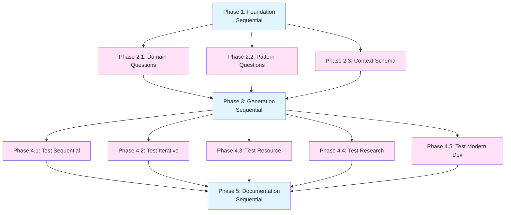

# Tasks - Dynamic Template Generation

**Pattern**: Modern Development Workflow

**Task Philosophy**: Research → Design → Implement → Validate → Deploy

---

## Phase Structure

### Phase 1: Foundation & Research (Sequential 🐌)

**Goal**: Understand current system and prepare for overhaul

- [ ] **🐌 1.1 Audit existing pattern templates**
  - Read all 5 pattern templates (15 files total: requirements, design, tasks × 5)
  - Document all tech-specific jargon instances
  - Categorize content: structural, pattern-specific, domain-specific, tech-specific
  - Create audit report in `results/template-audit.md`
  - _Context: ~25K tokens_
  - _Duration: ~20 minutes_

- [ ] **🐌 1.2 Extract structural patterns**
  - Identify common structure across patterns (phases, task format, EARS syntax)
  - Create minimal structural templates (placeholders only, zero jargon)
  - Save to `ouroboros/templates/structures/{pattern}-{doc-type}-structure.md`
  - Validate structures preserve pattern characteristics
  - _Context: ~15K tokens_
  - _Duration: ~15 minutes_

- [ ] **🐌 1.3 Create jargon detection rules**
  - Define forbidden terms per domain
  - Create `ouroboros/validators/jargon-detector.yaml`
  - Include allowed exceptions (e.g., "API" OK in docs/software domains)
  - Test rules against existing templates (should catch violations)
  - _Context: ~8K tokens_
  - _Duration: ~10 minutes_

### Phase 2: Context Gathering System (3 parallel 🐍)

**Goal**: Build intelligent question flow for each domain

- [ ] **🐍 2.1 Design domain detection questions**
  - Create plain-language domain selection (no jargon like "CRUD")
  - Write clear examples for each domain option
  - Add "Help me decide" flow with clarifying questions
  - Test questions with non-technical scenarios
  - Save to `ouroboros/intelligence/domain-questions.md`
  - _Context: ~12K tokens_
  - _Duration: ~12 minutes_
  - **Can run in parallel with 2.2, 2.3**

- [ ] **🐍 2.2 Create pattern-specific questionnaires**
  - For each pattern, define scope questions (domain-aware)
  - Resource Management: "What resources?", "What operations?"
  - Structured Sequential: "What are the steps?", "What's the output?"
  - Creative Iterative: "What's the vision?", "How will you evaluate?"
  - Exploratory Research: "What's the hypothesis?", "What's unknown?"
  - Modern Dev: "What are you building?", "How will it be used?"
  - Save to `ouroboros/intelligence/pattern-questions/{pattern}.md`
  - _Context: ~20K tokens_
  - _Duration: ~18 minutes_
  - **Can run in parallel with 2.1, 2.3**

- [ ] **🐍 2.3 Build context storage schema**
  - Design JSON schema for storing user answers
  - Include: featureName, domain, pattern, scopeAnswers, timestamp
  - Create save/load functions for context
  - Plan to store in `ouroboros/specs/{feature}/.context.json`
  - _Context: ~10K tokens_
  - _Duration: ~10 minutes_
  - **Can run in parallel with 2.1, 2.2**

### Phase 3: LLM Generation Engine (Sequential 🐌)

**Goal**: Build dynamic spec generation system

- [ ] **🐌 3.1 Create generation prompt templates**
  - Design LLM prompts for requirements, design, tasks generation
  - Include pattern structure, domain context, user answers
  - Add anti-jargon instructions
  - Create examples for each pattern × domain combination (25 total)
  - Save to `ouroboros/intelligence/generation-prompts/{doc-type}.md`
  - _Context: ~30K tokens_
  - _Duration: ~25 minutes_

- [ ] **🐌 3.2 Implement generation logic in /ou-new-spec**
  - Read `.claude/commands/ou-new-spec.md`
  - Add context gathering flow (use questions from Phase 2)
  - Add LLM generation calls (use prompts from 3.1)
  - Add preview and refinement loop
  - Preserve --static flag for fallback
  - _Context: ~35K tokens_
  - _Duration: ~30 minutes_

- [ ] **🐌 3.3 Add validation pipeline**
  - Implement jargon detection (use rules from 1.3)
  - Validate pattern structure compliance
  - Check EARS format in requirements
  - Verify parallelization logic in tasks
  - Show validation results to user before saving
  - _Context: ~25K tokens_
  - _Duration: ~20 minutes_

### Phase 4: Testing & Refinement (5 parallel 🐍)

**Goal**: Validate dynamic generation across all patterns and domains

- [ ] **🐍 4.1 Test Structured Sequential pattern**
  - Create test spec: "documentation-generation" (docs domain)
  - Create test spec: "morning-routine-optimizer" (planning domain)
  - Verify zero tech jargon in planning spec
  - Verify docs spec uses appropriate terminology
  - Validate structure compliance
  - _Context: ~20K tokens_
  - _Duration: ~18 minutes_
  - **Can run in parallel with 4.2, 4.3, 4.4, 4.5**

- [ ] **🐍 4.2 Test Creative Iterative pattern**
  - Create test spec: "logo-design" (creative domain)
  - Create test spec: "blog-post-series" (docs domain)
  - Verify iteration/feedback language is appropriate
  - Validate quality evaluation criteria are subjective
  - _Context: ~20K tokens_
  - _Duration: ~18 minutes_
  - **Can run in parallel with 4.1, 4.3, 4.4, 4.5**

- [ ] **🐍 4.3 Test Resource Management pattern**
  - Create test spec: "vacation-booking-api" (software domain)
  - Create test spec: "recipe-collection" (planning domain)
  - Verify software spec has tech terms (appropriate here)
  - Verify planning spec uses plain language
  - _Context: ~20K tokens_
  - _Duration: ~18 minutes_
  - **Can run in parallel with 4.1, 4.2, 4.4, 4.5**

- [ ] **🐍 4.4 Test Exploratory Research pattern**
  - Create test spec: "performance-investigation" (software domain)
  - Create test spec: "competitor-analysis" (data domain)
  - Verify hypothesis-driven language
  - Validate unknown scope is reflected in tasks
  - _Context: ~20K tokens_
  - _Duration: ~18 minutes_
  - **Can run in parallel with 4.1, 4.2, 4.3, 4.5**

- [ ] **🐍 4.5 Test Modern Dev Workflow pattern**
  - Re-run "ouroboros-meta-test" with dynamic generation
  - Verify it generates testing-appropriate tasks (NOT Docker/K8s)
  - Compare to manually-written version (should be 80% similar)
  - Validate this fixes DISC-001
  - _Context: ~20K tokens_
  - _Duration: ~18 minutes_
  - **Can run in parallel with 4.1, 4.2, 4.3, 4.4**

### Phase 5: Documentation & Rollout (Sequential 🐌)

**Goal**: Document changes and enable users

- [ ] **🐌 5.1 Update CLAUDE.md documentation**
  - Document new question flow
  - Explain dynamic vs static templates
  - Add examples of generated specs
  - Update /ou-new-spec usage instructions
  - _Context: ~15K tokens_
  - _Duration: ~12 minutes_

- [ ] **🐌 5.2 Create migration guide**
  - Document for users with existing specs (no impact)
  - Document for new specs (dynamic by default)
  - Explain --static flag usage
  - Create before/after examples
  - Save to `ouroboros/MIGRATION-DYNAMIC-TEMPLATES.md`
  - _Context: ~12K tokens_
  - _Duration: ~10 minutes_

- [ ] **🐌 5.3 Update README and QUICKSTART**
  - Update README with dynamic generation benefits
  - Update QUICKSTART with new question examples
  - Add "tech-agnostic in practice" proof
  - Include screenshot/example of generated spec
  - _Context: ~10K tokens_
  - _Duration: ~10 minutes_

- [ ] **🐌 5.4 Complete meta-test validation**
  - Re-run ouroboros-meta-test from scratch
  - Verify dynamic generation works end-to-end
  - Update test report with success metrics
  - Mark DISC-001 as RESOLVED
  - Close the Ouroboros loop 🐍
  - _Context: ~15K tokens_
  - _Duration: ~12 minutes_

---

## Task Dependency Graph

---

## Success Metrics

**Completion Criteria**:
- [ ] All 5 patterns tested across 2+ domains each
- [ ] Zero jargon violations in non-software specs
- [ ] User editing time < 5 minutes (measured via meta-test)
- [ ] 80%+ of generated content is project-specific
- [ ] ouroboros-meta-test completes without manual template editing
- [ ] DISC-001 marked RESOLVED

**Quality Gates**:
- All generated specs pass jargon validation
- Pattern structures preserved (verified programmatically)
- EARS format compliance in requirements
- Parallelization logic correct in tasks

---

## Estimated Totals

**Context Budget**: ~370K tokens across all phases
**Duration**: ~4 hours sequential execution, ~2.5 hours with parallelization
**Files Modified**:
- 1 command file (`.claude/commands/ou-new-spec.md`)
- 15 new structure templates
- 1 validation config
- 5+ intelligence/prompt files
- 3 documentation files

**Deliverables**:
- Fully dynamic template generation system
- Zero tech-jargon in non-code projects
- Ouroboros truly tech-agnostic
- Meta-test validation complete

---

🐍 The serpent sheds its old, rigid skin and grows new, adaptive scales that fit any form... 🐍

**Generated from Ouroboros Pattern**: Modern Development Workflow
**Created**: 2025-10-26
**Priority**: CRITICAL
