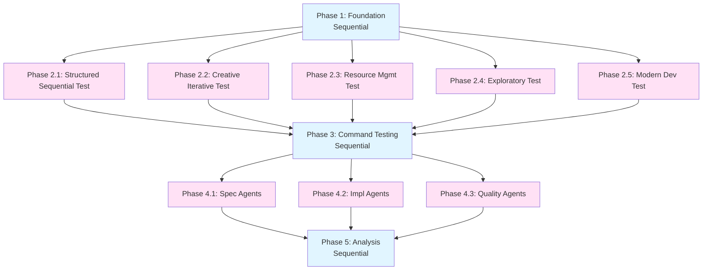

# Tasks - Ouroboros Meta Test

**Pattern**: Modern Development Workflow

**Task Philosophy**: Foundation → Test Creation (parallel tracks) → Test Execution → Analysis & Reporting

---

## Phase Structure

### Phase 1: Foundation (Sequential 🐌)

**Goal**: Prepare test infrastructure and identify test scope

- [ ] **🐌 1.1 Create test directory structure**
  - Create `ouroboros/specs/ouroboros-meta-test/test-cases/` directory
  - Create `ouroboros/specs/ouroboros-meta-test/results/` directory
  - Set up test tracking documents
  - _Context: ~5K tokens_
  - _Duration: ~5 minutes_

- [ ] **🐌 1.2 Inventory testable components**
  - List all slash commands to test (/ou-new-spec, /ou-expand-spec, /ou:proposal, /ou:apply, /ou:archive)
  - List all agents to test (spec-requirements, spec-design, spec-tasks, spec-impl, spec-test, spec-validator, spec-judge)
  - List all 5 patterns to validate
  - Create test coverage checklist
  - _Context: ~8K tokens_
  - _Duration: ~10 minutes_

- [ ] **🐌 1.3 Document UX issue: CRUD question**
  - Add to discoveries.md: "UX Issue: CRUD terminology in /ou-new-spec is confusing to non-technical users"
  - Recommend simplification (e.g., "Does this involve managing data/resources (create, view, edit, delete)?")
  - Tag for improvement in future Ouroboros updates
  - _Context: ~3K tokens_
  - _Duration: ~5 minutes_

### Phase 2: Test Case Creation (5 parallel 🐍)

**Goal**: Create representative test specs for each pattern

- [ ] **🐍 2.1 Create Structured Sequential test case**
  - Test spec: "documentation-generation-test"
  - Scenario: Generate comprehensive CLI documentation
  - Validates: Sequential phases, validation gates, structured output
  - _Context: ~15K tokens_
  - _Duration: ~12 minutes_
  - **Can run in parallel with 2.2, 2.3, 2.4, 2.5**

- [ ] **🐍 2.2 Create Creative Iterative test case**
  - Test spec: "logo-design-test"
  - Scenario: Design new Ouroboros visual identity
  - Validates: Feedback loops, iteration cycles, subjective quality
  - _Context: ~15K tokens_
  - _Duration: ~12 minutes_
  - **Can run in parallel with 2.1, 2.3, 2.4, 2.5**

- [ ] **🐍 2.3 Create Resource Management test case**
  - Test spec: "spec-api-test"
  - Scenario: Build API for managing Ouroboros specs
  - Validates: CRUD operations, state tracking, validation
  - _Context: ~15K tokens_
  - _Duration: ~12 minutes_
  - **Can run in parallel with 2.1, 2.2, 2.4, 2.5**

- [ ] **🐍 2.4 Create Exploratory Research test case**
  - Test spec: "token-optimization-research"
  - Scenario: Investigate token reduction strategies
  - Validates: Discovery workflow, hypothesis testing, unknown scope
  - _Context: ~15K tokens_
  - _Duration: ~12 minutes_
  - **Can run in parallel with 2.1, 2.2, 2.3, 2.5**

- [ ] **🐍 2.5 Validate Modern Dev Workflow (this spec!)**
  - Test spec: "ouroboros-meta-test" (self-reference)
  - Scenario: This meta-test itself
  - Validates: Framework can dogfood itself
  - _Context: ~10K tokens_
  - _Duration: ~8 minutes_
  - **Can run in parallel with 2.1, 2.2, 2.3, 2.4**

### Phase 3: Slash Command Testing (Sequential 🐌)

**Goal**: Validate all slash commands work correctly

- [ ] **🐌 3.1 Test /ou-new-spec command**
  - Execute on fresh test case
  - Verify directory structure created
  - Verify templates copied correctly
  - Verify pattern detection works
  - Document any UX issues found
  - _Context: ~12K tokens_
  - _Duration: ~10 minutes_

- [ ] **🐌 3.2 Test /ou-expand-spec command**
  - Execute on template spec
  - Test both interactive and auto modes
  - Verify placeholders replaced
  - Verify pattern-specific customization
  - _Context: ~20K tokens_
  - _Duration: ~15 minutes_

- [ ] **🐌 3.3 Test /ou:proposal command**
  - Create test proposal for spec change
  - Verify scaffolding created
  - Verify strict validation works
  - _Context: ~15K tokens_
  - _Duration: ~12 minutes_

- [ ] **🐌 3.4 Test /ou:apply command**
  - Apply test proposal
  - Verify implementation tracking
  - Verify task synchronization
  - _Context: ~18K tokens_
  - _Duration: ~15 minutes_

- [ ] **🐌 3.5 Test /ou:archive command**
  - Archive test deployment
  - Verify specs updated correctly
  - Verify archive structure
  - _Context: ~12K tokens_
  - _Duration: ~10 minutes_

### Phase 4: Agent Testing (3 parallel 🐍)

**Goal**: Validate agent behavior and outputs

- [ ] **🐍 4.1 Test spec-building agents**
  - spec-requirements: Validate EARS format generation
  - spec-design: Validate architecture documentation
  - spec-tasks: Validate task breakdown and parallelization
  - _Context: ~25K tokens_
  - _Duration: ~18 minutes_
  - **Can run in parallel with 4.2, 4.3**

- [ ] **🐍 4.2 Test implementation agents**
  - spec-impl: Validate code generation from tasks
  - spec-test: Validate test creation (docs + code)
  - _Context: ~25K tokens_
  - _Duration: ~18 minutes_
  - **Can run in parallel with 4.1, 4.3**

- [ ] **🐍 4.3 Test quality agents**
  - spec-validator: Validate requirement verification
  - spec-judge: Validate spec evaluation
  - spec-quality: Validate quality analysis (universal agent)
  - code-reviewer: Validate code review feedback
  - _Context: ~25K tokens_
  - _Duration: ~18 minutes_
  - **Can run in parallel with 4.1, 4.2**

### Phase 5: Analysis & Reporting (Sequential 🐌)

**Goal**: Consolidate findings, generate test report

- [ ] **🐌 5.1 Analyze token usage**
  - Compare estimated vs actual token usage across all tests
  - Calculate variance percentages
  - Identify optimization opportunities
  - Generate token-analysis.md report
  - _Context: ~15K tokens_
  - _Duration: ~12 minutes_

- [ ] **🐌 5.2 Consolidate discoveries**
  - Aggregate all UX issues found
  - List all bugs encountered
  - Document enhancement opportunities
  - Prioritize by impact
  - Generate discoveries.md report
  - _Context: ~20K tokens_
  - _Duration: ~15 minutes_

- [ ] **🐌 5.3 Generate comprehensive test report**
  - Create executive summary
  - Document test results by component (slash commands, agents, patterns)
  - Include pass/fail status for each test
  - Calculate coverage percentage
  - Generate recommendations for Ouroboros improvements
  - Create final test-report.md
  - _Context: ~25K tokens_
  - _Duration: ~18 minutes_

- [ ] **🐌 5.4 Validate meta-loop: Feed discoveries back**
  - Identify which discoveries should update Ouroboros specs
  - Create proposals for high-priority improvements (e.g., fix CRUD UX issue)
  - Verify the serpent can eat its own tail 🐍
  - _Context: ~15K tokens_
  - _Duration: ~12 minutes_

---

## Task Dependency Graph

---

## Success Metrics

**Coverage Goals**:
- [ ] 100% of slash commands tested
- [ ] 100% of agent types tested
- [ ] 100% of pattern templates validated
- [ ] At least 3 UX improvements documented
- [ ] Token variance within ±20% of estimates

**Quality Goals**:
- [ ] All critical workflows pass without errors
- [ ] Test report is comprehensive and actionable
- [ ] Discoveries feed back into Ouroboros improvements
- [ ] Meta-test proves framework dogfooding capability

---

**Generated from Ouroboros Pattern**: Modern Development Workflow
**Template Version**: 1.0
**Last Updated**: 2025-10-26