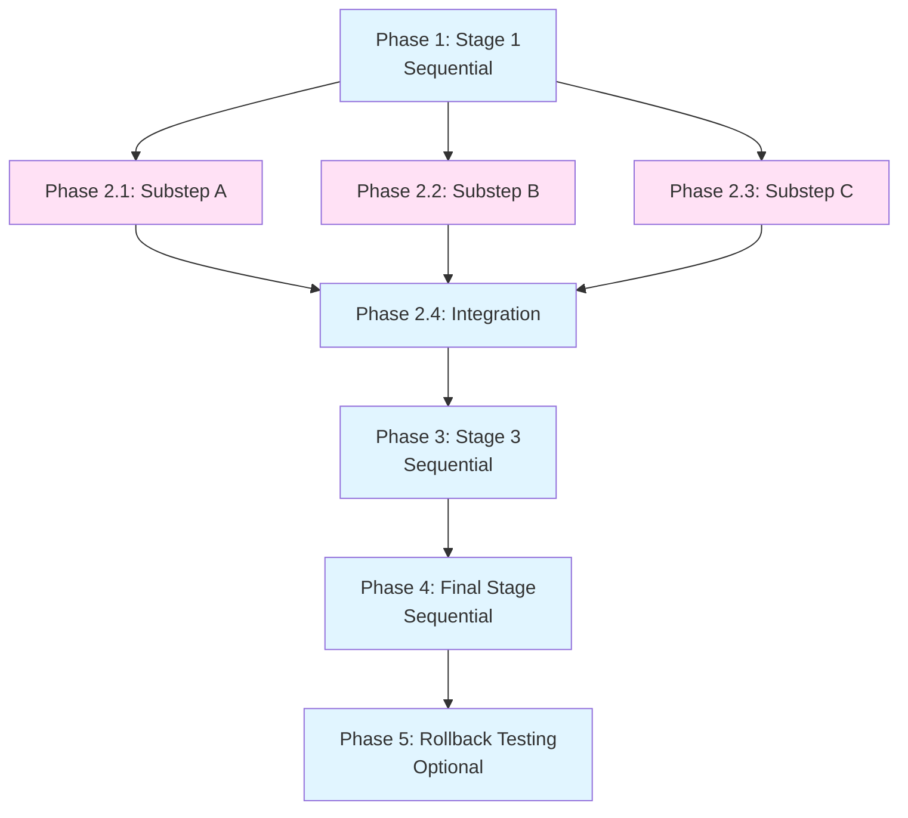

# Tasks - [Project Name]

**Pattern**: Structured Sequential Workflow

**Task Philosophy**: Mostly sequential phases (one per stage), with parallel substeps where stages allow internal parallelization.

---

## Execution Overview

**Total Phases**: [4-7 typical for this pattern]
**Parallel Tasks**: [Substeps within stages]
**Sequential Tasks**: [Main stage progression]
**Context Window**: 200K tokens per agent (Sonnet 4.5)
**Safety Margin**: <150K tokens per agent

---

## Phase Structure

### Phase 1: [Stage 1 Name] (Sequential 🐌)

**Goal**: [What Stage 1 accomplishes]

**Why Sequential**: This is the foundation stage - all subsequent stages depend on it.

- [ ] **🐌 1.1 [Primary Task for Stage 1]**
  - [Subtask 1]
  - [Subtask 2]
  - [Subtask 3]
  - _Requirements: [Reference to requirements doc]_
  - _Files: [Files that will be created/modified]_
  - _Estimated context: ~[X]K tokens_
  - _Duration: ~[X] minutes_

- [ ] **🐌 1.2 [Validation Task for Stage 1]**
  - [Validation check 1]
  - [Validation check 2]
  - [Validation check 3]
  - _Requirements: [Reference to requirements doc]_
  - _Files: [Files that will be validated]_
  - _Estimated context: ~[X]K tokens_
  - _Duration: ~[X] minutes_

**Stage 1 Success Criteria**:
- [ ] All validation gates pass
- [ ] Output artifacts ready for Stage 2
- [ ] Rollback capability tested

---

### Phase 2: [Stage 2 Name] ([N] parallel 🐍 if substeps independent)

**Goal**: [What Stage 2 accomplishes]

**Depends On**: Phase 1 complete

**Parallelization**: [Explain what can run in parallel within this stage]

<!-- PARALLEL_GROUP_START: stage2_substeps | Phase 2 | [N] agents -->

- [ ] **🐍 2.1 [Substep 1 of Stage 2]**
  - [Detail 1]
  - [Detail 2]
  - [Detail 3]
  - _Requirements: [Reference to requirements doc]_
  - _Files: [Files that will be created/modified]_
  - _Estimated context: ~[X]K tokens_
  - _Duration: ~[X] minutes_
  - **Can run in parallel with 2.2, 2.3**

- [ ] **🐍 2.2 [Substep 2 of Stage 2]**
  - [Detail 1]
  - [Detail 2]
  - [Detail 3]
  - _Requirements: [Reference to requirements doc]_
  - _Files: [Files that will be created/modified]_
  - _Estimated context: ~[X]K tokens_
  - _Duration: ~[X] minutes_
  - **Can run in parallel with 2.1, 2.3**

- [ ] **🐍 2.3 [Substep 3 of Stage 2]**
  - [Detail 1]
  - [Detail 2]
  - _Requirements: [Reference to requirements doc]_
  - _Files: [Files that will be created/modified]_
  - _Estimated context: ~[X]K tokens_
  - _Duration: ~[X] minutes_
  - **Can run in parallel with 2.1, 2.2**

<!-- PARALLEL_GROUP_END -->

- [ ] **🐌 2.4 [Integration/Validation Task for Stage 2]**
  - Integrate outputs from 2.1, 2.2, 2.3
  - Run validation gates
  - Prepare for Stage 3
  - _Dependencies: 2.1, 2.2, 2.3 complete_
  - _Estimated context: ~[X]K tokens_
  - _Duration: ~[X] minutes_

**Stage 2 Success Criteria**:
- [ ] All parallel substeps complete
- [ ] Integration successful
- [ ] Validation gates pass
- [ ] Output ready for Stage 3

---

### Phase 3: [Stage 3 Name] (Sequential 🐌 or parallel 🐍)

**Goal**: [What Stage 3 accomplishes]

**Depends On**: Phase 2 complete

- [ ] **🐌 3.1 [Primary Task for Stage 3]**
  - [Subtask 1]
  - [Subtask 2]
  - [Subtask 3]
  - _Requirements: [Reference to requirements doc]_
  - _Files: [Files that will be created/modified]_
  - _Estimated context: ~[X]K tokens_
  - _Duration: ~[X] minutes_

- [ ] **🐌 3.2 [Validation Task for Stage 3]**
  - [Validation check 1]
  - [Validation check 2]
  - _Requirements: [Reference to requirements doc]_
  - _Files: [Files that will be validated]_
  - _Estimated context: ~[X]K tokens_
  - _Duration: ~[X] minutes_

**Stage 3 Success Criteria**:
- [ ] Stage processing complete
- [ ] Validation gates pass
- [ ] Ready for final stage

---

### Phase 4: [Final Stage Name] (Sequential 🐌)

**Goal**: [What final stage accomplishes - typically output, publishing, or deployment]

**Depends On**: Phase 3 complete

- [ ] **🐌 4.1 [Final Processing Task]**
  - [Subtask 1]
  - [Subtask 2]
  - [Subtask 3]
  - _Requirements: [Reference to requirements doc]_
  - _Files: [Files that will be created/modified]_
  - _Estimated context: ~[X]K tokens_
  - _Duration: ~[X] minutes_

- [ ] **🐌 4.2 [Final Validation & Verification]**
  - Run end-to-end validation
  - Test rollback capability
  - Document final outputs
  - _Requirements: [Reference to requirements doc]_
  - _Files: [Files that will be validated]_
  - _Estimated context: ~[X]K tokens_
  - _Duration: ~[X] minutes_

**Final Stage Success Criteria**:
- [ ] All outputs produced
- [ ] End-to-end validation passes
- [ ] Rollback tested
- [ ] Documentation complete

---

## Rollback Test Phase (Optional but Recommended)

### Phase 5: Rollback & Recovery Testing (Sequential 🐌)

**Goal**: Validate rollback capability at each stage

- [ ] **🐌 5.1 Test Rollback from Final Stage**
  - Simulate failure at final stage
  - Execute rollback procedure
  - Validate state restored to Stage 3
  - _Estimated context: ~[X]K tokens_
  - _Duration: ~[X] minutes_

- [ ] **🐌 5.2 Test Rollback from Mid-Stages**
  - Simulate failure at Stage 3
  - Simulate failure at Stage 2
  - Validate rollback procedures work
  - _Estimated context: ~[X]K tokens_
  - _Duration: ~[X] minutes_

---

## Task Dependency Graph



---

## Context Budget Summary

| Phase | Tasks | Total Context | Max per Agent | Status |
|-------|-------|---------------|---------------|--------|
| 1 | [N] | [X]K | [X]K | ✅ Safe |
| 2 | [N] 🐍 | [X]K | [X]K | ✅ Safe |
| 3 | [N] | [X]K | [X]K | ✅ Safe |
| 4 | [N] | [X]K | [X]K | ✅ Safe |
| 5 | [N] | [X]K | [X]K | ✅ Safe |

**Total Context**: ~[X]K tokens
**Max Agent Context**: [X]K (well below 150K safety margin)
**All tasks safe for execution** ✅

---

## Time Estimates

**Sequential execution**: ~[X] minutes ([Sum of all task durations])
**With parallelism**: ~[X] minutes ([Account for parallel phases])
**Time savings**: ~[X] minutes ([Percentage]% reduction) 🐍

---

## Cross-Domain Examples

### Example 1: Code - Data Pipeline Tasks

```
Phase 1: Ingestion Setup (Sequential 🐌)
  🐌 1.1 Create ingestion module
  🐌 1.2 Test with sample data

Phase 2: Validation & Transformation (3 parallel 🐍)
  🐍 2.1 Implement schema validator
  🐍 2.2 Implement data transformer
  🐍 2.3 Implement error logger
  🐌 2.4 Integration testing

Phase 3: Loading Mechanism (Sequential 🐌)
  🐌 3.1 Implement database loader
  🐌 3.2 Test atomic transactions

Phase 4: End-to-End Validation (Sequential 🐌)
  🐌 4.1 Run full pipeline test
  🐌 4.2 Validate rollback capability
```

---

### Example 2: Documentation - User Guide Tasks

```
Phase 1: Outline Creation (Sequential 🐌)
  🐌 1.1 Research and draft outline
  🐌 1.2 Stakeholder review and approval

Phase 2: Content Drafting (4 parallel 🐍)
  🐍 2.1 Write getting started section
  🐍 2.2 Write features documentation
  🐍 2.3 Write API reference
  🐍 2.4 Create examples and screenshots

Phase 3: Review & Revision (Sequential 🐌)
  🐌 3.1 Technical review
  🐌 3.2 Editorial review
  🐌 3.3 Incorporate feedback

Phase 4: Publishing (Sequential 🐌)
  🐌 4.1 Generate documentation site
  🐌 4.2 Validate links and images
  🐌 4.3 Deploy to production
```

---

### Example 3: Planning - Event Organization Tasks

```
Phase 1: Venue Selection (Sequential 🐌)
  🐌 1.1 Research venue options
  🐌 1.2 Site visits and evaluation
  🐌 1.3 Book venue

Phase 2: Parallel Arrangements (3 parallel 🐍)
  🐍 2.1 Arrange catering
  🐍 2.2 Book entertainment
  🐍 2.3 Plan decorations
  🐌 2.4 Coordinate timing

Phase 3: Invitations & Registration (Sequential 🐌)
  🐌 3.1 Create and send invitations
  🐌 3.2 Track RSVPs
  🐌 3.3 Finalize headcount

Phase 4: Day-of Execution (Sequential 🐌)
  🐌 4.1 Setup and vendor coordination
  🐌 4.2 Event execution
  🐌 4.3 Teardown and follow-up
```

---

### Example 4: Scripts - Deployment Tasks

```
Phase 1: Pre-Deployment (Sequential 🐌)
  🐌 1.1 Run pre-flight checks
  🐌 1.2 Create backup

Phase 2: Deployment Steps (Sequential 🐌)
  🐌 2.1 Deploy application
  🐌 2.2 Run health checks
  🐌 2.3 Execute smoke tests

Phase 3: Validation (Sequential 🐌)
  🐌 3.1 Monitor metrics
  🐌 3.2 Validate critical paths

Phase 4: Rollback Testing (Sequential 🐌)
  🐌 4.1 Test rollback procedure
  🐌 4.2 Document deployment
```

---

## Execution Recommendations

### Parallelization Strategy

**When to parallelize**:
- ✅ Substeps within a stage that operate on different resources
- ✅ Substeps that don't modify the same files
- ✅ Substeps with clearly defined boundaries

**When to keep sequential**:
- ⛔ Main stage progression (by definition in this pattern)
- ⛔ Tasks with dependencies on previous outputs
- ⛔ Integration and validation tasks

### Validation Checkpoints

**After each phase**:
- [ ] Review phase summary report
- [ ] Validate all acceptance criteria met
- [ ] Approve progression to next phase

**Final validation**:
- [ ] End-to-end workflow test
- [ ] Rollback capability verified
- [ ] All documentation complete

---

## Pattern-Specific Best Practices

1. **Clear Stage Boundaries**: Each phase should have well-defined start/end
2. **Validation Gates**: Don't skip validation between stages
3. **Rollback Testing**: Test rollback early, not just at the end
4. **State Preservation**: Document what state needs to be preserved
5. **Error Handling**: Plan for errors at each stage
6. **Parallel Substeps**: Look for opportunities to parallelize within stages
7. **Integration Points**: Always have integration/consolidation after parallel work

---

**Generated from Ouroboros Pattern**: Structured Sequential Workflow
**Template Version**: 1.0
**Last Updated**: 2025-10-25

---

## Customization Checklist

Before using this template, customize:
- [ ] Replace [Project Name] with actual project name
- [ ] Define number of phases (typically 4-7 for this pattern)
- [ ] Break down each stage into specific tasks
- [ ] Identify parallelization opportunities within stages
- [ ] Estimate context budget per task
- [ ] Estimate duration per task
- [ ] Add validation tasks after each stage
- [ ] Document task dependencies
- [ ] Add rollback testing if appropriate
- [ ] Review cross-domain examples for inspiration
- [ ] Ensure all validation gates are defined
