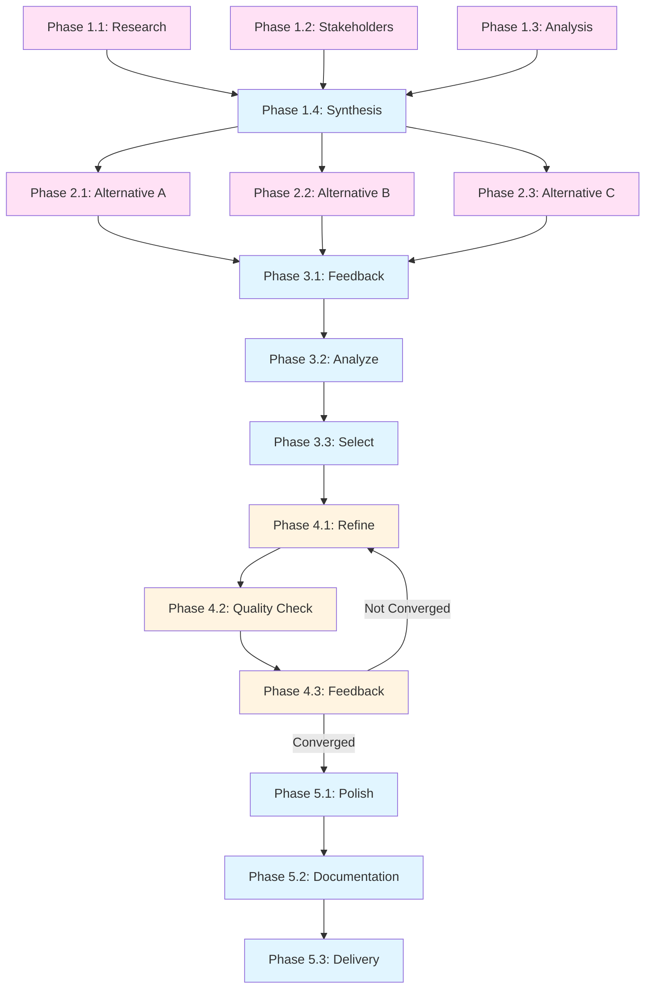

# Tasks - [Project Name]

**Pattern**: Creative Iterative Process

**Task Philosophy**: Parallel exploration → Feedback loops → Iterative refinement → Convergence

---

## Execution Overview

**Total Phases**: [3-5 typical for this pattern]
**Iteration Cycles**: [2-4 expected]
**Max Iterations**: [N] (safeguard)
**Parallel Tasks**: [Initial exploration and alternative creation]
**Sequential Tasks**: [Feedback, analysis, finalization]

---

## Phase Structure

### Phase 1: Research & Exploration (Parallel 🐍)

**Goal**: Gather inspiration, understand constraints, explore possibilities

<!-- PARALLEL_GROUP_START: exploration | Phase 1 | 3-4 agents -->

- [ ] **🐍 1.1 Research & Inspiration**
  - Gather examples and inspiration
  - Analyze patterns and trends
  - Document findings
  - _Requirements: [Reference]_
  - _Files: [Research notes, inspiration library]_
  - _Estimated context: ~[X]K tokens_
  - _Duration: ~[X] minutes_
  - **Can run in parallel with 1.2, 1.3**

- [ ] **🐍 1.2 Stakeholder & Constraint Discovery**
  - Interview stakeholders
  - Document preferences and requirements
  - Identify constraints (budget, time, technical)
  - Map success criteria
  - _Requirements: [Reference]_
  - _Files: [Stakeholder notes, constraints doc]_
  - _Estimated context: ~[X]K tokens_
  - _Duration: ~[X] minutes_
  - **Can run in parallel with 1.1, 1.3**

- [ ] **🐍 1.3 Competitive/Comparative Analysis**
  - Analyze similar work (competitors, alternatives, prior art)
  - Identify gaps and opportunities
  - Document differentiation strategy
  - _Requirements: [Reference]_
  - _Files: [Analysis report]_
  - _Estimated context: ~[X]K tokens_
  - _Duration: ~[X] minutes_
  - **Can run in parallel with 1.1, 1.2**

<!-- PARALLEL_GROUP_END -->

- [ ] **🐌 1.4 Synthesis & Direction Setting**
  - Consolidate research findings
  - Identify promising directions
  - Get stakeholder alignment on approach
  - _Dependencies: 1.1, 1.2, 1.3 complete_
  - _Estimated context: ~[X]K tokens_
  - _Duration: ~[X] minutes_

**Phase 1 Success Criteria**:
- [ ] Research sufficiently comprehensive
- [ ] Constraints clearly documented
- [ ] Direction(s) identified and approved
- [ ] Ready to create initial draft(s)

---

### Phase 2: Initial Creation (Parallel 🐍 if exploring alternatives)

**Goal**: Create initial draft(s) or prototype(s)

**Option A: Parallel Alternatives** (if exploring multiple directions)

<!-- PARALLEL_GROUP_START: alternatives | Phase 2 | 3-4 agents -->

- [ ] **🐍 2.1 Create Alternative A: [Direction Name]**
  - Develop concept fully
  - Document approach and rationale
  - Create presentation-ready version
  - _Requirements: [Reference]_
  - _Files: [Alternative A files]_
  - _Estimated context: ~[X]K tokens_
  - _Duration: ~[X] minutes_
  - **Can run in parallel with 2.2, 2.3**

- [ ] **🐍 2.2 Create Alternative B: [Direction Name]**
  - Develop concept fully
  - Document approach and rationale
  - Create presentation-ready version
  - _Requirements: [Reference]_
  - _Files: [Alternative B files]_
  - _Estimated context: ~[X]K tokens_
  - _Duration: ~[X] minutes_
  - **Can run in parallel with 2.1, 2.3**

- [ ] **🐍 2.3 Create Alternative C: [Direction Name]**
  - Develop concept fully
  - Document approach and rationale
  - Create presentation-ready version
  - _Requirements: [Reference]_
  - _Files: [Alternative C files]_
  - _Estimated context: ~[X]K tokens_
  - _Duration: ~[X] minutes_
  - **Can run in parallel with 2.1, 2.2**

<!-- PARALLEL_GROUP_END -->

**Option B: Single Draft** (if direction is clear)

- [ ] **🐌 2.1 Create Initial Draft/Prototype**
  - Develop all major components
  - Ensure minimum quality threshold
  - Prepare for feedback
  - _Requirements: [Reference]_
  - _Files: [Draft files]_
  - _Estimated context: ~[X]K tokens_
  - _Duration: ~[X] minutes_

**Phase 2 Success Criteria**:
- [ ] Draft(s) complete and reviewable
- [ ] All major components included
- [ ] Ready for stakeholder feedback
- [ ] Documentation of choices made

---

### Phase 3: Feedback & Selection (Sequential 🐌)

**Goal**: Collect feedback, select direction (if alternatives), plan refinement

- [ ] **🐌 3.1 Collect Stakeholder Feedback**
  - Present draft(s) to stakeholders
  - Gather structured feedback
  - Document quantitative and qualitative input
  - Identify conflicting feedback
  - _Dependencies: Phase 2 complete_
  - _Estimated context: ~[X]K tokens_
  - _Duration: ~[X] minutes_

- [ ] **🐌 3.2 Analyze & Prioritize Feedback**
  - Categorize feedback by type and priority
  - Identify patterns and themes
  - Resolve conflicts where possible
  - Create prioritized refinement plan
  - _Dependencies: 3.1 complete_
  - _Estimated context: ~[X]K tokens_
  - _Duration: ~[X] minutes_

- [ ] **🐌 3.3 Select Direction (if alternatives explored)**
  - Evaluate alternatives against criteria
  - Make selection or blend approaches
  - Get stakeholder approval
  - Document decision and rationale
  - _Dependencies: 3.2 complete_
  - _Estimated context: ~[X]K tokens_
  - _Duration: ~[X] minutes_
  - **Skip if only one draft created**

**Phase 3 Success Criteria**:
- [ ] All stakeholder feedback collected
- [ ] Feedback prioritized and actionable
- [ ] Direction selected (if applicable)
- [ ] Refinement plan created

---

### Phase 4: Iteration Cycle (Repeatable)

**Goal**: Refine based on feedback, check quality, iterate if needed

**⚠️ This phase may repeat 2-4 times (max [N] iterations)**

#### Iteration N: Refinement

- [ ] **🐌 4.1 Implement Refinements**
  - Address high-priority feedback
  - Implement medium-priority changes where feasible
  - Document decisions on deferred items
  - Preserve what works well
  - _Dependencies: Phase 3 complete (or previous iteration)_
  - _Requirements: [Reference]_
  - _Files: [Updated files]_
  - _Estimated context: ~[X]K tokens_
  - _Duration: ~[X] minutes_

- [ ] **🐌 4.2 Quality Check & Self-Review**
  - Evaluate against quality criteria
  - Compare to previous iteration (improvement?)
  - Identify remaining gaps
  - Assess convergence
  - _Dependencies: 4.1 complete_
  - _Estimated context: ~[X]K tokens_
  - _Duration: ~[X] minutes_

- [ ] **🐌 4.3 Feedback Round (if not converged)**
  - Collect stakeholder feedback on refined version
  - Assess quality scores
  - Determine if another iteration needed
  - _Dependencies: 4.2 complete_
  - _Estimated context: ~[X]K tokens_
  - _Duration: ~[X] minutes_

**Decision Point: Continue or Finalize?**

✅ **Move to Finalization if**:
- [ ] Quality threshold met
- [ ] All critical feedback addressed
- [ ] Stakeholder approval received
- [ ] Diminishing returns on further iterations

🔄 **Loop back to 4.1 if**:
- [ ] Quality threshold not yet met
- [ ] Critical feedback outstanding
- [ ] Under max iteration limit

⚠️ **Escalate if**:
- [ ] Max iterations reached without convergence
- [ ] Unresolvable stakeholder conflicts

---

### Phase 5: Finalization (Sequential 🐌)

**Goal**: Apply final polish, prepare for delivery

- [ ] **🐌 5.1 Final Polish**
  - Apply finishing touches
  - Address edge cases
  - Final quality pass
  - _Dependencies: Phase 4 converged_
  - _Requirements: [Reference]_
  - _Files: [Final files]_
  - _Estimated context: ~[X]K tokens_
  - _Duration: ~[X] minutes_

- [ ] **🐌 5.2 Documentation & Handoff**
  - Document design decisions
  - Create usage guidelines (if applicable)
  - Prepare handoff materials
  - Archive iteration history
  - _Dependencies: 5.1 complete_
  - _Estimated context: ~[X]K tokens_
  - _Duration: ~[X] minutes_

- [ ] **🐌 5.3 Delivery & Validation**
  - Deliver final version
  - Validate acceptance
  - Collect final stakeholder sign-off
  - Document lessons learned
  - _Dependencies: 5.2 complete_
  - _Estimated context: ~[X]K tokens_
  - _Duration: ~[X] minutes_

**Phase 5 Success Criteria**:
- [ ] Final version delivered
- [ ] All stakeholders approve
- [ ] Documentation complete
- [ ] Lessons learned captured

---

## Iteration Tracking

### Iteration 1
- **Changes Made**: [Summary]
- **Feedback Addressed**: [Count high/medium/low]
- **Quality Score**: [Score, change from previous]
- **Stakeholder Satisfaction**: [Metric]
- **Remaining Gaps**: [Count]
- **Convergence Assessment**: [Improving/Stable/Needs work]

### Iteration 2
- **Changes Made**: [Summary]
- **Feedback Addressed**: [Count]
- **Quality Score**: [Score, change]
- **Stakeholder Satisfaction**: [Metric]
- **Remaining Gaps**: [Count]
- **Convergence Assessment**: [Improving/Stable/Good]

### Iteration 3
- **Changes Made**: [Summary]
- **Feedback Addressed**: [Count]
- **Quality Score**: [Score, change]
- **Stakeholder Satisfaction**: [Metric]
- **Remaining Gaps**: [Count]
- **Convergence Assessment**: [Ready for finalization]

---

## Task Dependency Graph



---

## Context Budget Summary

| Phase | Tasks | Total Context | Max per Agent | Status |
|-------|-------|---------------|---------------|--------|
| 1 | 4 (3🐍) | [X]K | [X]K | ✅ Safe |
| 2 | 3🐍 | [X]K | [X]K | ✅ Safe |
| 3 | 3 | [X]K | [X]K | ✅ Safe |
| 4 | 3 (×N iter) | [X]K per iteration | [X]K | ✅ Safe |
| 5 | 3 | [X]K | [X]K | ✅ Safe |

**Total Context**: ~[X]K tokens (excluding iterations)
**Per Iteration**: +[X]K tokens
**All tasks safe for execution** ✅

---

## Time Estimates

**Phase 1 (Exploration)**: ~[X] minutes (with parallelism)
**Phase 2 (Creation)**: ~[X] minutes (with parallelism if alternatives)
**Phase 3 (Feedback)**: ~[X] minutes (sequential)
**Phase 4 (Iteration × N)**: ~[X] minutes per iteration
**Phase 5 (Finalization)**: ~[X] minutes (sequential)

**Total Time (with [N] iterations)**: ~[X] minutes
**vs Sequential**: ~[X] minutes
**Time savings**: ~[X] minutes ([X]% reduction) 🐍

---

## Cross-Domain Examples

### Example 1: Code - UI/UX Design

```
Phase 1: Research (3 parallel 🐍)
  🐍 1.1 Research competitor UIs
  🐍 1.2 Interview users
  🐍 1.3 Analyze design trends
  🐌 1.4 Synthesize findings

Phase 2: Wireframes (Single 🐌)
  🐌 2.1 Create wireframes

Phase 3: Feedback (Sequential 🐌)
  🐌 3.1 User testing
  🐌 3.2 Analyze feedback

Phase 4: Iteration ×2 (Sequential 🐌)
  Iteration 1: Refine navigation, adjust colors
  Iteration 2: Add search, improve mobile

Phase 5: Finalization (Sequential 🐌)
  🐌 5.1 Design system
  🐌 5.2 Developer handoff
```

---

### Example 2: Documentation - Blog Post

```
Phase 1: Research (3 parallel 🐍)
  🐍 1.1 Topic research
  🐍 1.2 Audience analysis
  🐍 1.3 Competitive content review
  🐌 1.4 Outline creation

Phase 2: Drafting (Sequential 🐌)
  🐌 2.1 Write first draft

Phase 3: Feedback (Sequential 🐌)
  🐌 3.1 Editorial review
  🐌 3.2 Technical review
  🐌 3.3 Analyze feedback

Phase 4: Iteration ×2 (Sequential 🐌)
  Iteration 1: Improve structure, add examples
  Iteration 2: Tighten prose, enhance examples

Phase 5: Publishing (Sequential 🐌)
  🐌 5.1 Copy edit
  🐌 5.2 SEO optimize
  🐌 5.3 Publish
```

---

### Example 3: Planning - Vacation Itinerary

```
Phase 1: Research (3 parallel 🐍)
  🐍 1.1 Destination research
  🐍 1.2 Family preferences
  🐍 1.3 Budget analysis
  🐌 1.4 Initial planning

Phase 2: Itinerary Creation (Sequential 🐌)
  🐌 2.1 Draft itinerary

Phase 3: Feedback (Sequential 🐌)
  🐌 3.1 Family review
  🐌 3.2 Analyze preferences

Phase 4: Iteration ×3 (Sequential 🐌)
  Iteration 1: Reduce pace, add downtime
  Iteration 2: Add evening activities
  Iteration 3: Optimize hotels

Phase 5: Booking (Sequential 🐌)
  🐌 5.1 Book flights
  🐌 5.2 Reserve hotels
  🐌 5.3 Pre-book activities
```

---

## Pattern-Specific Best Practices

1. **Parallel Exploration**: Create alternatives in parallel in Phase 2 if uncertain
2. **Max Iterations**: Set hard limit (3-4 typical) to prevent infinite loops
3. **Quality Tracking**: Track quality scores across iterations to see convergence
4. **Feedback Structure**: Use structured feedback forms for consistency
5. **Version Control**: Preserve all iterations, don't overwrite
6. **Stakeholder Availability**: Ensure stakeholders can provide timely feedback
7. **Diminishing Returns**: Stop when improvements become marginal
8. **Scope Control**: Don't add new features during refinement, only improve existing

---

**Generated from Ouroboros Pattern**: Creative Iterative Process
**Template Version**: 1.0
**Last Updated**: 2025-10-25

---

## Customization Checklist

Before using this template, customize:
- [ ] Define number of expected iterations
- [ ] Set max iteration limit
- [ ] Choose parallel alternatives vs. single draft
- [ ] Define quality criteria and thresholds
- [ ] Identify stakeholders for feedback
- [ ] Plan feedback collection mechanism
- [ ] Estimate context and time per phase
- [ ] Add domain-specific tasks
- [ ] Review iteration stopping criteria
- [ ] Plan version control approach
