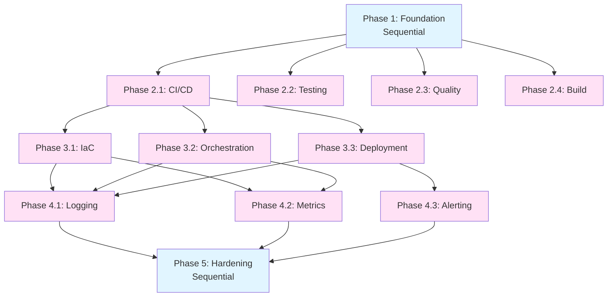

# Tasks - [Project Name]

**Pattern**: Modern Development Workflow

**Task Philosophy**: Foundation → Automation (parallel tracks) → Deployment → Observability

---

## Phase Structure

### Phase 1: Foundation (Sequential 🐌)

**Goal**: Build core functionality

- [ ] **🐌 1.1 Implement core API/functionality**
- [ ] **🐌 1.2 Setup data layer and schema**
- [ ] **🐌 1.3 Implement business logic**
- [ ] **🐌 1.4 Manual testing and verification**

### Phase 2: Automation (4 parallel 🐍)

**Goal**: Automate testing, building, and quality checks

- [ ] **🐍 2.1 Setup CI/CD pipeline**
  - Configure CI tool (GitHub Actions, GitLab CI, Jenkins)
  - Define pipeline stages
  - _Can run in parallel with 2.2, 2.3, 2.4_

- [ ] **🐍 2.2 Implement automated testing**
  - Write unit tests
  - Write integration tests
  - Configure test coverage reporting
  - _Can run in parallel with 2.1, 2.3, 2.4_

- [ ] **🐍 2.3 Setup code quality gates**
  - Configure linting
  - Setup code formatters
  - Add security scanning
  - _Can run in parallel with 2.1, 2.2, 2.4_

- [ ] **🐍 2.4 Create build automation**
  - Docker multi-stage build
  - Optimize image size
  - Configure image scanning
  - _Can run in parallel with 2.1, 2.2, 2.3_

### Phase 3: Deployment (3 parallel 🐍)

**Goal**: Infrastructure, containerization, orchestration

- [ ] **🐍 3.1 Infrastructure as Code**
  - Define infrastructure in IaC (Terraform, etc.)
  - Configure environments (dev, staging, prod)
  - Setup state management
  - _Can run in parallel with 3.2, 3.3_

- [ ] **🐍 3.2 Container orchestration setup**
  - Create K8s manifests or equivalent
  - Configure deployments, services, ingress
  - Setup resource limits and autoscaling
  - _Can run in parallel with 3.1, 3.3_

- [ ] **🐍 3.3 Deployment automation**
  - GitOps configuration
  - Automated deployment to staging
  - Manual approval gate for production
  - Rollback procedures
  - _Can run in parallel with 3.1, 3.2_

### Phase 4: Observability (3 parallel 🐍)

**Goal**: Logging, metrics, tracing, alerting

- [ ] **🐍 4.1 Implement logging**
  - Structured JSON logging
  - Correlation IDs
  - Log aggregation setup
  - _Can run in parallel with 4.2, 4.3_

- [ ] **🐍 4.2 Implement metrics and monitoring**
  - Expose /metrics endpoint
  - Define key metrics (RED)
  - Create dashboards (Grafana, CloudWatch)
  - _Can run in parallel with 4.1, 4.3_

- [ ] **🐍 4.3 Setup alerting and tracing**
  - Configure alerts (error rate, latency, availability)
  - Implement distributed tracing (OpenTelemetry)
  - Setup notification channels
  - _Can run in parallel with 4.1, 4.2_

### Phase 5: Hardening & Documentation (Sequential 🐌)

**Goal**: Security hardening, runbooks, launch readiness

- [ ] **🐌 5.1 Security hardening**
  - Implement security best practices
  - Secrets management
  - Vulnerability remediation
  - Network security policies

- [ ] **🐌 5.2 Create runbooks and documentation**
  - Deployment runbook
  - Incident response playbook
  - Architecture documentation
  - API documentation

- [ ] **🐌 5.3 Launch readiness review**
  - End-to-end testing
  - Disaster recovery testing
  - Load testing
  - Final sign-off

---

## Task Dependency Graph



---

## Cross-Domain Examples

### Microservice
```
Phase 1: Build REST API
Phase 2: CI/CD + Tests + Docker + Linting (parallel)
Phase 3: Terraform + K8s + GitOps (parallel)
Phase 4: Logging + Prometheus + Alerts (parallel)
Phase 5: Security + Runbooks
```

### Doc-as-Code
```
Phase 1: Write documentation structure
Phase 2: CI + Link checker + Spellcheck + Build (parallel)
Phase 3: GitHub Pages setup + CDN + Deploy automation
Phase 4: Analytics + Uptime monitoring + Feedback
Phase 5: SEO + Style guide
```

### GitOps Infrastructure
```
Phase 1: Define core infrastructure needs
Phase 2: Terraform modules + Testing + Validation + Docs (parallel)
Phase 3: State backend + Apply automation + Drift detection
Phase 4: Change logs + Cost monitoring + Alerts
Phase 5: Disaster recovery + Compliance checks
```

---

**Generated from Ouroboros Pattern**: Modern Development Workflow
**Template Version**: 1.0
**Last Updated**: 2025-10-25
